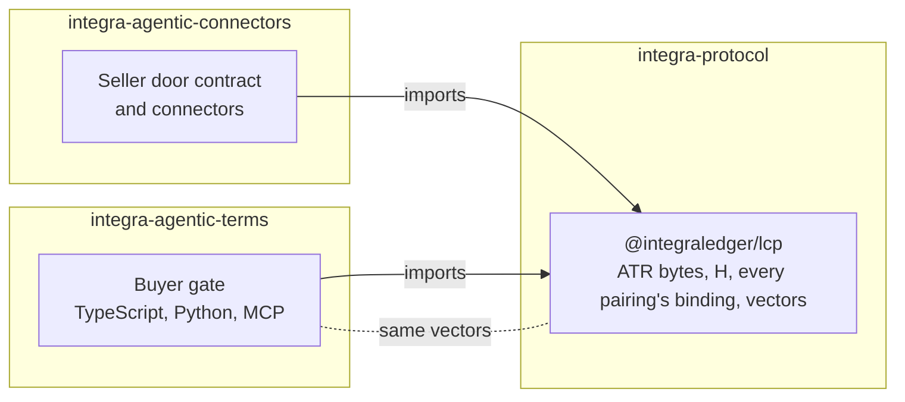

# integra-protocol

The reference implementation of the **Legal Context Protocol (LCP)**: an agreement's record, its hash, and that hash
bound into the payment, so paying is agreeing to that exact record.

An AI agent that buys from another agent reads terms, negotiates and pays. LCP makes the payment prove what was
agreed. The seller assembles the agreement's record, the **Agentic Transaction Record (ATR)**, and advertises its
SHA-256 hash, **H**, in the payment challenge. The buyer fetches the record, checks that it hashes to H, and signs a
payment that carries H in the field its protocol or rail provides. Anyone holding the record can then match it to the
payment, and on most rails to the settlement on chain.

This repository holds [`@integraledger/lcp`](./lcp), which implements that binding for x402, MPP, ACP, UCP, AP2, ACK,
Visa TAP, Mastercard Verifiable Intent and A2A, across EVM chains, Solana, Stellar, the XRP Ledger, Hedera, Algorand,
Aptos, Cardano, Casper, Concordium, NEAR, Polkadot Asset Hub, Starknet, Sui, Tron, TON, Tempo, Stacks and
Lightning; its [documentation](./docs); and the shared test vectors that fix the rules byte for byte across languages.

## How the pieces fit



`@integraledger/lcp` is the one owner of each rule: assembling the ATR, hashing it, comparing hashes, and each
pairing's binding. The buyer packages in
[`integra-agentic-terms`](https://github.com/IntegraLedger/integra-agentic-terms) and the seller-side packages in
[`integra-agentic-connectors`](https://github.com/IntegraLedger/integra-agentic-connectors) import it and add nothing
to those rules. The Python buyer gate implements the same rules a second time and passes the same vectors.

## Packages

| Package | Install | What it is |
|---|---|---|
| [`@integraledger/lcp`](./lcp) | `npm install @integraledger/lcp` | Assemble and hash an ATR, and bind H into x402, MPP, agentic checkout and card payments on every supported rail. |

## Quickstart

```sh
npm install @integraledger/lcp
```

```ts
import { assemble, hash, hashEquals, isRefusal, newAtrId } from "@integraledger/lcp";

// The seller assembles the ATR: its bytes, and H over exactly those bytes.
const atr = await assemble(newAtrId(), ["x402", { accepts: [] }], [
  ["terms", new TextEncoder().encode('{"text":"One report for 10000 base units of USDC."}')],
]);
if (isRefusal(atr)) throw new Error(atr.code);

// The buyer fetches the bytes and compares their hash with H before it signs anything.
console.log(hashEquals(await hash(atr.bytes), atr.atrHash));
```

```text
true
```

The [package README](./lcp/README.md) walks one x402 payment through both sides, and
[Getting started](./docs/getting-started.md) goes step by step.

## Documentation

- [Getting started](./docs/getting-started.md)
- Concepts: [the ATR](./docs/concepts/atr.md), [the ATR hash](./docs/concepts/atr-hash.md),
  [binding](./docs/concepts/binding.md), [pairings](./docs/concepts/pairings.md),
  [the buyer gate](./docs/concepts/buyer-gate.md), [refusals](./docs/concepts/refusals.md),
  [vectors](./docs/concepts/vectors.md)
- Guides: [seller](./docs/guides/seller.md), [buyer](./docs/guides/buyer.md),
  [channels, sessions and subscriptions](./docs/guides/sessions.md), [x402](./docs/guides/x402.md),
  [MPP](./docs/guides/mpp.md), [agentic checkouts](./docs/guides/checkouts.md), [rails](./docs/guides/rails.md),
  [discovery](./docs/guides/discovery.md)
- Reference: [entry points](./docs/reference/entry-points.md), [pairings](./docs/reference/pairings.md),
  [refusal codes](./docs/reference/refusals.md), [vector files](./docs/reference/vectors.md),
  [API](./docs/reference/api)

The same pages are published at [lcp.integraledger.com](https://lcp.integraledger.com), with `llms.txt`,
`llms-full.txt` and every page as Markdown for AI agents.

## Repository layout

| Path | Contents |
|---|---|
| [`lcp/`](./lcp) | The `@integraledger/lcp` package: `src/`, its tests, `vectors/` and `profiles/`. |
| [`docs/`](./docs) | The documentation, in Markdown. It is the single source of the documentation site. |
| [`website/`](./website) | The documentation site app, built from `docs/`. It is not part of any published package. |
| [`scripts/`](./scripts) | The checks that run every code sample in the READMEs and `docs/`, and regenerate the reference pages. |

## Building and testing

You need Node.js `26.10.0` (see `.node-version`) and pnpm `11.27.1`. These are the commands CI runs:

```sh
pnpm install --frozen-lockfile
pnpm -r --if-present run build
pnpm -r --if-present run typecheck
pnpm -r --if-present run test

# The shared vectors, byte-exact
pnpm --filter @integraledger/lcp exec vitest run test/vectors.test.ts test/core.test.ts

# Every code sample in the READMEs and docs/ compiles, runs and prints what the page shows
node scripts/docs-samples.mjs

# The generated reference pages and the README's pairing list match the package
node scripts/docs-reference.mjs --check
```

To build the documentation site:

```sh
cd website
pnpm install --frozen-lockfile
pnpm build
```

## Contributing

Contributions are welcome. Read [CONTRIBUTING.md](./CONTRIBUTING.md) first. Every commit is signed off under the
[Developer Certificate of Origin](https://developercert.org): add `Signed-off-by: Your Name <you@example.com>` with
`git commit -s`. CI checks every commit for it. Every code sample in the documentation is compiled and run in CI, so a
change that alters behaviour updates the samples that show it.

This project follows the [Contributor Covenant](./CODE_OF_CONDUCT.md).

## Security

Report a bug in a public issue. Report a vulnerability privately, through
[GitHub's private vulnerability reporting](https://github.com/IntegraLedger/integra-protocol/security/advisories/new)
on this repository, never in a public issue. See [SECURITY.md](./SECURITY.md).

## License

[Apache-2.0](./LICENSE).
