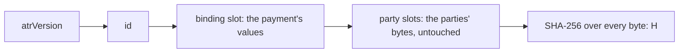

# The Agentic Transaction Record

An **Agentic Transaction Record (ATR)** is the agreement's record: one JSON document that the seller serves and the
buyer fetches before it pays. The payment carries the ATR's hash, so paying is agreeing to that exact record.

This package decides nothing about what an ATR says. It fixes only three things: a format marker, a per-transaction
identifier, and the values that tie the record to one payment. Everything else is the parties' content, carried
exactly as given.

## The byte layout

`assemble` writes one UTF-8 JSON object with its members in a fixed order:

| Position | Member | Value |
|---|---|---|
| 1 | `atrVersion` | Always the string `"1"`. |
| 2 | `id` | The per-transaction identifier you pass, as a JSON string. `newAtrId()` gives a random RFC 9562 version 4 UUID. |
| 3 | the binding slot | The values that tie this record to one payment, written with `JSON.stringify`. The pairing's `tie` gives the slot: `x402` for x402, `mpp` for MPP, and so on. |
| 4 onward | the party slots | Each party slot's bytes, exactly as received, in the order given. |



The party slots are never parsed into values, re-serialised or canonicalised. `assemble` checks only that each one
holds exactly one JSON value in well-formed UTF-8, then copies its bytes. A seller that stores the returned bytes and
a buyer that fetches them hash the same thing.

## Assembling an ATR

This example assembles the ATR of the package's first core vector, and prints its bytes and its hash:

```ts
import { assemble } from "@integraledger/lcp";

const utf8 = new TextEncoder();
const atr = await assemble(
  "6f1c2b0e-8d4a-4c3b-9e2f-1a7d5c9b3e40",
  ["bind", { k: "v", n: 7, list: ["a", "b"] }],
  [
    ["terms", utf8.encode('"Pay 10000 base units of USDC for one report."')],
    ["seller", utf8.encode('{"name":"Acme Reports"}')],
  ],
);
if ("refused" in atr) throw new Error(atr.code);

console.log(new TextDecoder().decode(atr.bytes));
console.log(atr.atrHash);
```

```text
{"atrVersion":"1","id":"6f1c2b0e-8d4a-4c3b-9e2f-1a7d5c9b3e40","bind":{"k":"v","n":7,"list":["a","b"]},"terms":"Pay 10000 base units of USDC for one report.","seller":{"name":"Acme Reports"}}
0xf693f8353bd93131403120d11e849c7646ad8976857560b9f72ac2ebe08de12f
```

The same inputs always give the same bytes. A party slot keeps its own spacing and member order: a slot received as
`{ "b": 1,  "a": 2 }` is written with that spacing and in that order.

## The rules `assemble` enforces

`assemble(id, binding, content, limits?)` returns `{ bytes, atrHash }`, or a [refusal](./refusals.md) that names the
first rule an input breaks:

| Rule | Refusal |
|---|---|
| Every slot name matches `^[A-Za-z0-9][A-Za-z0-9._-]{0,63}$`. | `core/slot-name` |
| No slot is named `atrVersion` or `id`, and no party slot takes the binding slot's name. | `core/slot-reserved` |
| No two party slots share a name. | `core/slot-duplicate` |
| Each party slot's bytes are well-formed UTF-8 without a byte-order mark, and hold exactly one JSON value (RFC 8259) nested at most 64 levels deep. | `core/content-not-json` |
| The binding value is a JSON value that `JSON.stringify` writes exactly: every number a safe integer, every string free of unpaired surrogates, nested at most 64 levels deep. | `core/binding-not-json` |
| At most 64 party slots, and the whole record at most `limits.maxBytes` bytes (1 MiB by default, and never more than 1 MiB). | `core/too-large` |

## Who stores it

The ATR is delivered, not kept by this package. The seller writes the bytes to its own storage and serves them at an
`https` link, and the buyer keeps its own copy. `assemble` holds nothing after it returns.

## Next

- [The ATR hash](./atr-hash.md): the hash of these bytes, and the forms it is written in.
- [Binding](./binding.md): how the hash rides in a payment.
