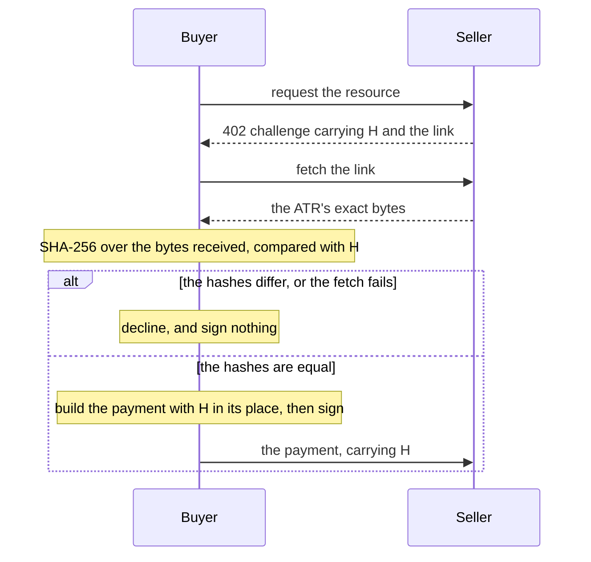

# The buyer gate

The **buyer gate** is the buyer-side check that compares the served bytes with H before anything is signed. It is the
one step that makes paying mean agreeing: the buyer signs only a payment bound to a record it has fetched, hashed and
kept.



## The steps

1. **Read.** The pairing's `read(doc)` gives H, the link, and the options this pairing can pay. A document without a
   well-formed hash and `https` link is refused before anything is fetched.
2. **Fetch.** Fetch the link and keep the bytes exactly as received. Bound the fetch: this package's shared vectors
   fix a limit of 1 MiB on the body, a 10-second deadline, and no redirects. Ask for the bytes as they are
   (`Accept-Encoding: identity`) and decline an answer in any other content coding, such as `gzip` or `br`: the hash is
   over the bytes served, never over bytes a decoder produced.
3. **Compare.** `hashEquals(await hash(bytes), h)`. On any difference, stop: nothing is signed.
4. **Build and sign.** The pairing's `build(choice, h)` returns what the signer signs, with H in its place. Pass the H
   you compared, never a value read again from the document.
5. **Finish.** `complete(signature)` gives the payment. Before sending it, `bound(payment)` reads H back from what was
   signed; it must equal the H you compared.
6. **Keep the bytes.** The buyer's copy of the ATR is its record of what it agreed to.

## One changed byte

The comparison is over bytes, not meaning. Re-serialising the same JSON, or changing one byte, gives another hash:

```ts
import { hash, hashEquals } from "@integraledger/lcp";

const utf8 = new TextEncoder();
const served = utf8.encode('{"atrVersion":"1","id":"0f8fad5b-d9cb-469f-a165-70867728950e","terms":"10000 units"}');
const h = await hash(served);

const reformatted = utf8.encode(JSON.stringify(JSON.parse(new TextDecoder().decode(served)), null, 1));
const edited = served.slice();
edited[served.length - 3] = 0x31;

console.log(hashEquals(await hash(served), h));
console.log(hashEquals(await hash(reformatted), h));
console.log(hashEquals(await hash(edited), h));
```

```text
true
false
false
```

## The gate as a package

This package gives the gate's pieces: `read`, `hash`, `hashEquals`, `build` and `bound`. The buyer packages in
[`integra-agentic-terms`](https://github.com/IntegraLedger/integra-agentic-terms) assemble them into one gate with a
bounded fetch and named declines, for TypeScript, Python and MCP clients. They follow the rows of
[`vectors/buyer.json`](../../lcp/vectors/buyer.json), which this package ships:

| Row outcome | When |
|---|---|
| `hash-mismatch` | The served bytes do not hash to H: one changed byte, the same JSON written another way, or an agreement resource advertising another ATR's hash. |
| `signed-not-bound` | What the signer returned does not carry the H the buyer compared. |
| `offer-unreadable` | The pairing's `read` refused the document, or its `build` refused the option with the buyer's inputs, such as a Stellar simulated transfer whose amount, token or payer is not the option's; the row carries the refusal code, and nothing is signed. |
| `link-not-https` | The link or the agreement URL is not `https`. Nothing is fetched. |
| `atr-unfetchable` | The fetch redirected, returned an error status, failed, did not answer in time, or answered in a content coding other than `identity`. |
| `atr-too-large` | The body is larger than 1 MiB. The fetch is cancelled. |
| `signer-failed` | The signer rejected. |
| `no-payable-option` | No option is payable by the buyer's accounts. Nothing is fetched. |
| `pairing-not-supported` | The pairing id is not one the gate implements. |
| `agreement-pending` | An agreement payment was made and its receipt did not arrive in time; the full payment is not signed. |
| `agreement-failed` | The agreement's receipt names another ATR's hash, or an agreement answer is in a content coding other than `identity`; the full payment is not signed. |

## The agreement URL

Where a pairing's payment carries H in nothing public, the seller may advertise an **agreement URL**
(`legalContextAgreementUrl`) beside the link. The buyer first pays that URL, whose payment carries H publicly, and
pays the full payment only after its `200` receipt names the same H. Where the chosen pairing's payment is itself a
public proof of H (`pattern.publicProof`), the buyer does not pay the agreement URL.

The agreement payment is a payment like any other, so the buyer's agent approves it before anything is signed:

1. **Fetch** the agreement URL's `402` and check that it advertises the same H.
2. **Choose** its option with the main payment's rule: the options in order, the first the signer can pay whose
   pairing's payment is itself a public proof of H.
3. **Hand the agent** that option's amount, token (`asset`), payee (`payTo`) and network, and sign only once it
   approves.
4. **Pay and wait** for the `200` receipt. The exchange is bounded by the chosen option's `maxTimeoutSeconds` plus
   180 seconds; `maxTimeoutSeconds` is a JSON number with an integral value, so `60.0` is `60`.

The buyer vector rows `BA1` to `BA11` fix this order, the approval and the bounds.

## Next

- [Buyer](../guides/buyer.md): the gate in code, step by step.
- [Vectors](./vectors.md): running the shared rows.
