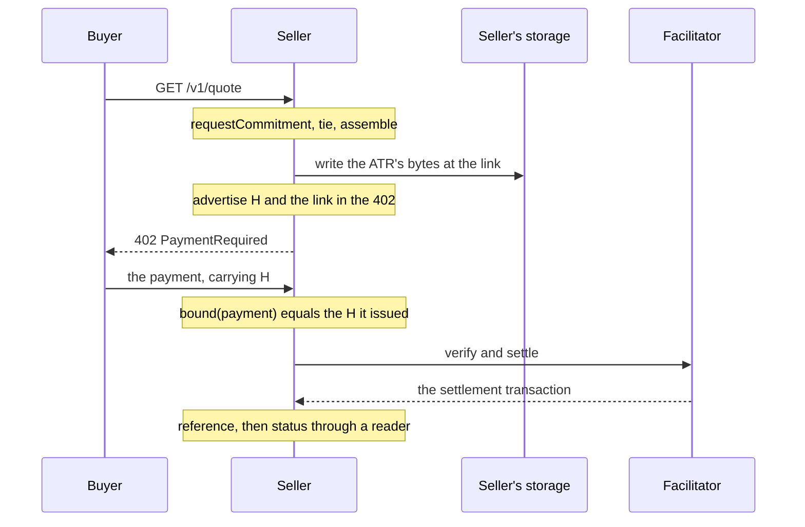

# Seller

The **seller** is the party serving the resource. Its side of the binding has four steps: assemble the ATR for this
request, advertise H in the challenge, read H back from the payment it receives, and read the settlement from the
rail. This guide walks them on x402 with `x402/exact/eip155/eip3009`. Every pairing has the same members, so the
shape is the same on every surface.



The **facilitator** is the x402 role that verifies and settles. It is the seller's to choose; this package does not
call it.

## 1. Assemble the ATR for this request

The ATR's binding slot ties the record to one payment. On x402, `tie(accepts, request)` records every option the
challenge offers, exactly as issued, and the commitment to the request it answers: the method, the path, the query
and SHA-256 over the body exactly as received. The party slots carry whatever the parties agreed, as bytes.

## 2. Store the bytes and link them

Write the ATR's bytes to your own storage before the challenge goes out, and serve them unchanged at an `https` link.
If the write fails, send no challenge: a buyer that cannot fetch the record declines.

## 3. Advertise H

`advertise(doc, h, link, offer)` returns a copy of the challenge with `extensions.legalContext` set to
`{"type":"sha256","value":H,"legalContextUrl":link}`, and leaves every other extension and every option as they were.
On pairings that carry H in the option itself, such as `x402/exact/solana` (`extra.memo`), it also places H there.

## 4. Check the payment

`bound(payment)` reads H from what the buyer presented: here, the EIP-3009 authorization's `nonce`. Match it with
`hashEquals` against the H you issued for this request. The token contract verifies the signature when it executes
the transfer; `bound` does not.

Refuse a payment whose H you did not issue for this request, and one whose H you have already accepted. Those two
facts are your records, not this package's.

## 5. Read the settlement

`reference(payment)` gives the keys for finding this payment on chain: the network, the token, the time bound, a
digest of the transfer, and the log that carries H. After the facilitator settles, `status` reads the settlement
transaction through a reader you supply, and `recover` reads H back from that transaction alone.

## The whole flow

This program runs every step above. A `Map` stands in for the seller's storage, a random key for the buyer's signer,
and a reader built from one receipt for the chain. No network is used.

```ts
import { assemble, hashEquals, newAtrId } from "@integraledger/lcp";
import { AUTHORIZATION_USED_TOPIC, type EvmReader, type Hex } from "@integraledger/lcp/evm";
import {
  exactEip3009,
  requestCommitment,
  tie,
  type PaymentRequired,
  type PaymentRequirements,
} from "@integraledger/lcp/x402";
import type { TypedDataDefinition } from "viem";
import { generatePrivateKey, privateKeyToAccount } from "viem/accounts";

const option: PaymentRequirements = {
  scheme: "exact",
  network: "eip155:84532",
  amount: "10000",
  asset: "0x036CbD53842c5426634e7929541eC2318f3dCF7e",
  payTo: "0x209693Bc6afc0C5328bA36FaF03C514EF312287C",
  maxTimeoutSeconds: 60,
  extra: { name: "USDC", version: "2" },
};
const challenge: PaymentRequired = {
  x402Version: 2,
  resource: { url: "https://api.seller.example/v1/quote" },
  accepts: [option],
};

// 1. Assemble the ATR for this request.
const request = await requestCommitment({ method: "GET", target: "/v1/quote", body: new Uint8Array() });
if ("refused" in request) throw new Error(request.code);
const terms = new TextEncoder().encode('{"text":"One quote for 10000 base units of USDC."}');
const atr = await assemble(newAtrId(), tie(challenge.accepts, request), [["terms", terms]]);
if ("refused" in atr) throw new Error(atr.code);

// 2. Store the bytes and link them.
const link = `https://atr.seller.example/${atr.atrHash}`;
const storage = new Map([[link, atr.bytes]]);

// 3. Advertise H.
const advertised = exactEip3009.advertise(challenge, atr.atrHash, link, option);
if ("refused" in advertised) throw new Error(advertised.code);
console.log("advertised:", JSON.stringify(advertised.extensions?.["legalContext"]?.info) === JSON.stringify({
  type: "sha256",
  value: atr.atrHash,
  legalContextUrl: link,
}));

// The buyer's side, in brief: see the buyer guide.
const payer = privateKeyToAccount(generatePrivateKey());
const unsigned = await exactEip3009.build({ required: advertised, accepted: option, from: payer.address, now: 1790000000 }, atr.atrHash);
if ("refused" in unsigned) throw new Error(unsigned.code);
const payment = unsigned.complete(await payer.signTypedData(unsigned.typedData as TypedDataDefinition));
if ("refused" in payment) throw new Error(payment.code);

// 4. Check the payment.
const h = await exactEip3009.bound(payment);
if (typeof h !== "string") throw new Error(h.code);
console.log("bound to the issued H:", hashEquals(h, atr.atrHash), storage.has(link));

// 5. Read the settlement. The facilitator's settle answer names the transaction.
const ref = await exactEip3009.reference(payment);
if ("refused" in ref) throw new Error(ref.code);
const transaction: Hex = `0x${"11".repeat(32)}`;
const reader: EvmReader = {
  network: "eip155:84532",
  receipt: async () => ({
    status: 1,
    blockNumber: 100n,
    logs: [
      {
        address: option.asset as Hex,
        topics: [AUTHORIZATION_USED_TOPIC, `0x${payer.address.slice(2).toLowerCase().padStart(64, "0")}`, h],
        data: "0x",
      },
    ],
  }),
  blockNumber: async (tag) => (tag === "finalized" ? 100n : 105n),
  transaction: async () => null,
};
const status = await exactEip3009.status({ network: ref.network, asset: ref.asset, transaction, h }, reader);
console.log("status:", status.state, "finality" in status ? status.finality : status.why);
const recovered = await exactEip3009.recover({ network: ref.network, asset: ref.asset, transaction }, reader);
console.log("recovered from the chain alone:", typeof recovered === "string" && hashEquals(recovered, atr.atrHash));
```

```text
advertised: true
bound to the issued H: true true
status: settled finalized
recovered from the chain alone: true
```

## What the seller keeps

Keep H, the link and the reference for each payment. The bytes live in your storage at the link; the buyer keeps its
own copy.

## What this package does not do

It holds no key and signs nothing. It does not call the facilitator, move funds, or decide whether to serve a
request. It never compares amount, payee, asset, timing or payer with the ATR's content: the binding is the one thing
it checks.

## On other surfaces

The members are the same everywhere; what `tie`, `advertise` and `bound` handle differs:

- [x402](./x402.md): the `legalContext` extension, and every x402 pairing.
- [MPP](./mpp.md): H as the challenge id.
- [Agentic checkouts](./checkouts.md): ACP, UCP, AP2, ACK, card networks and A2A.
- [Channels, sessions and subscriptions](./sessions.md): one ATR for a whole channel.
