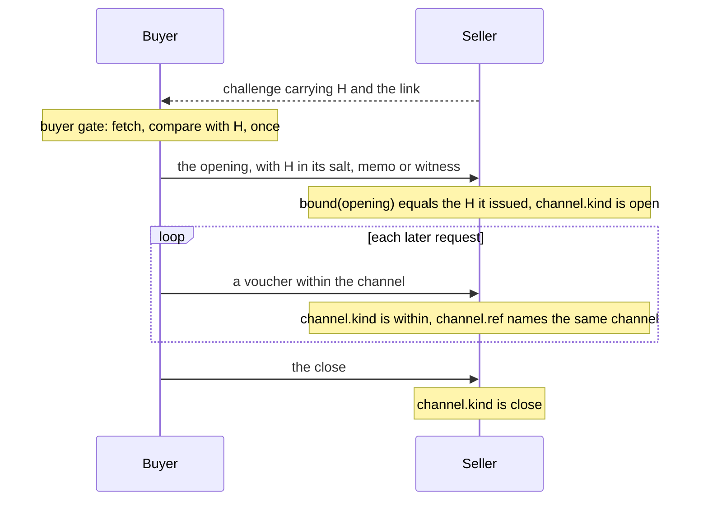

# Channels, sessions and subscriptions

Some payments are not one-off. An x402 `batch-settlement` channel takes a deposit and then pays each request with a
voucher. An MPP `session` does the same with a payment channel, and an MPP `subscription` activates once and renews
each period. Paying request by request under a fresh ATR each time would make every voucher an agreement of its own.

These pairings bind **one ATR to the whole channel, session or subscription**. H rides where the channel opens: in its
salt, its memo, or the authorization that activates it. The later payments within it carry no ATR of their own.
Another agreement opens another channel.



The buyer compares the served bytes with H once, at the opening. After that, a payment within the channel is tied to
the ATR through the channel it belongs to.

## The pairings

Ten pairings have a `channel` member. The table says where H rides at the opening, which later payments count as
within the channel, and what `channel.boundWithin` and `channel.until` read.

| Pairing | H at the opening | Within, and the close | `boundWithin` | `until` |
|---|---|---|---|---|
| `x402/batch-settlement/eip155` | The channel configuration's `salt`. The channel id, which the deposit authorization and every voucher sign, commits to it. | A voucher, or a refund with an amount, is within; a full refund is the close. | The `salt` of the payment's channel configuration, once it hashes to the voucher's channel id. | none |
| `x402/batch-settlement/solana` | The opening transaction's one Memo instruction, H's LCP string (the option's `extra.memo`). | A voucher or a top-up is within; a refund is the close. | Refuses `x402/not-bound-within`. | none |
| `mpp/session/evm` | The channel's `salt`: in the signed `open` call, the EIP-3009 nonce MPP derives over the channel parameters and the salt, or the Permit2 witness. | A voucher or a top-up is within; `close` is the close. | Refuses `mpp/not-bound-within`. | none |
| `mpp/session/tempo` | The `salt` of the signed `open` call to the channel escrow. | A voucher or a top-up is within; `close` is the close. | On the v2 escrow, the salt in the payment's channel descriptor, once the descriptor's channel id is the payment's channel. | none |
| `mpp/session/hedera` | The `salt` of the escrow's `open`. | A voucher, a top-up or a `use` is within; `close` is the close. | Refuses `mpp/not-bound-within`. | none |
| `mpp/session/solana` | The `open` instruction's `salt`: H's first 8 bytes. It binds those 8 bytes only: whoever assembles the ATR can construct a second ATR whose hash shares them. | A voucher, a top-up or a `use` is within; `close` is the close. | H from a `use` credential whose session proof names the opening challenge's id. | none |
| `mpp/session/xrpl` | The `PaymentChannelCreate`'s one memo, H's LCP string. | A voucher is within; `close` is the close. | Refuses `mpp/not-bound-within`. | The opening's `CancelAfter`, where it sets one. |
| `mpp/session/lightning` | The deposit invoice's description hash `h`, which the seller's node signs. | A bearer proof or a top-up is within; `close` is the close. | Refuses `mpp/not-bound-within`. | none |
| `mpp/subscription/tempo` | The `witness` of the key authorization the payer's root key signs. | Only the activation, a key authorization, is classified: it is the opening. | Refuses `mpp/not-bound-within`. | The request's `subscriptionExpires`. |
| `mpp/subscription/stripe` | The request's `methodDetails.metadata.legal_context`. | Every payment the seller reports on this pairing is the activation. | Refuses `mpp/not-bound-within`. | none |

This example lists them from the registry:

```ts
import { BINDINGS } from "@integraledger/lcp";

const channels = BINDINGS.filter((b) => "channel" in b).map((b) => b.id);
console.log(channels.length);
console.log(channels.sort().join("\n"));
```

```text
10
mpp/session/evm
mpp/session/hedera
mpp/session/lightning
mpp/session/solana
mpp/session/tempo
mpp/session/xrpl
mpp/subscription/stripe
mpp/subscription/tempo
x402/batch-settlement/eip155
x402/batch-settlement/solana
```

Two x402 pairings carry a request-scoped form of the same idea, with no `channel` member:
`x402/batch-settlement/cloudflare` echoes H in the `legalContext` extension of each request, and `x402/upto/solana`
opens a one-request payment channel whose opening transaction carries H as its memo.

The LCP profiles [`x402/batch-settlement/eip155`](../../lcp/profiles/x402-batch-settlement-eip155.md),
[`mpp/session/evm-tempo`](../../lcp/profiles/mpp-session-evm-tempo.md) and
[`mpp/session/hedera-solana-xrpl`](../../lcp/profiles/mpp-session-hedera-solana-xrpl.md) state the rules for these
bindings.

## The channel members

On top of the members every pairing has, a channel pairing has:

| Member | Side | What it does |
|---|---|---|
| `channel.kind(payment)` | seller | `"open"`, `"within"` or `"close"`, from the payment's own action or type, or a refusal. |
| `channel.ref(payment)` | seller | The channel's key: `{ network, channel }`. The opening and every payment within share it. |
| `channel.boundWithin(payment)` | seller | H from a payment within the channel, where the pairing's payments within carry it; otherwise a refusal. |
| `channel.until(payment)` | seller | The channel's end in Unix seconds, where its opening sets one. |
| `buildWithin(within, h)` | buyer | A later voucher, or the close, for a channel opened under H. It refuses a channel that was not. |
| `closeRef(challenge, channel)` | seller | The read keys of the channel's close, on the MPP sessions and on `mpp/subscription/tempo`. |

`buildWithin` exists on the two x402 channels and the MPP sessions on EVM, Tempo, Hedera, Solana and the XRP Ledger.
On MPP it builds a voucher or the close. It does not build a top-up, which is a further deposit, or Solana's operator
`use`.

`mpp/subscription/stripe`'s `channel.ref` takes the payment's receipt as a second argument: the Stripe subscription
it names is the channel.

## One channel, end to end

This program opens an x402 `batch-settlement` channel on an EVM chain, pays one voucher within it, and closes it.
Both sides run in one process: a random key stands in for the buyer's signer and no network is used. Signing uses
[viem](https://viem.sh).

```ts
import { assemble, hashEquals, newAtrId } from "@integraledger/lcp";
import { requestCommitment, tie, type PaymentRequired, type PaymentRequirements } from "@integraledger/lcp/x402";
import { batchEvm, type SigningRequest } from "@integraledger/lcp/x402-batch-settlement";
import type { TypedDataDefinition } from "viem";
import { generatePrivateKey, privateKeyToAccount } from "viem/accounts";

const payer = privateKeyToAccount(generatePrivateKey());
async function sign(requests: readonly SigningRequest[]): Promise<string[]> {
  const out: string[] = [];
  for (const r of requests) {
    if (r.kind !== "eip712") throw new Error(`this signer signs EIP-712 only, not ${r.kind}`);
    out.push(await payer.signTypedData(r.typedData as TypedDataDefinition));
  }
  return out;
}

// Seller: the channel option. 1000 base units of USDC per request, on Base Sepolia.
const option: PaymentRequirements = {
  scheme: "batch-settlement",
  network: "eip155:84532",
  amount: "1000",
  asset: "0x036CbD53842c5426634e7929541eC2318f3dCF7e",
  payTo: "0x209693Bc6afc0C5328bA36FaF03C514EF312287C",
  maxTimeoutSeconds: 60,
  extra: {
    name: "USDC",
    version: "2",
    receiverAuthorizer: "0x209693Bc6afc0C5328bA36FaF03C514EF312287C",
    withdrawDelay: 900,
  },
};
const challenge: PaymentRequired = {
  x402Version: 2,
  resource: { url: "https://api.seller.example/v1/stream" },
  accepts: [option],
};

// Seller: one ATR for the whole channel, and H advertised in the challenge.
const request = await requestCommitment({ method: "GET", target: "/v1/stream", body: new Uint8Array() });
if ("refused" in request) throw new Error(request.code);
const terms = new TextEncoder().encode('{"text":"1000 base units of USDC per request."}');
const atr = await assemble(newAtrId(), tie(challenge.accepts, request), [["terms", terms]]);
if ("refused" in atr) throw new Error(atr.code);
const advertised = batchEvm.advertise(challenge, atr.atrHash, `https://atr.seller.example/${atr.atrHash}`, option);
if ("refused" in advertised) throw new Error(advertised.code);

// Buyer: read H, compare the served bytes with it as the buyer guide shows, then open the channel with H as its salt.
const offer = batchEvm.read(advertised);
if ("refused" in offer) throw new Error(offer.code);
const accepted = offer.offer.options[0]!;
const unsignedOpening = await batchEvm.build(
  {
    required: advertised,
    accepted,
    from: payer.address,
    payerAuthorizer: payer.address,
    deposit: 100_000n,
    authSalt: `0x${"01".repeat(32)}`,
    now: Math.floor(Date.now() / 1000),
  },
  offer.h,
);
if ("refused" in unsignedOpening) throw new Error(unsignedOpening.code);
const kinds = unsignedOpening.requests.map((r) => (r.kind === "eip712" ? r.typedData.primaryType : r.kind));
console.log("the opening signs:", kinds);
const opening = unsignedOpening.complete(await sign(unsignedOpening.requests));
if ("refused" in opening) throw new Error(opening.code);

// Seller: the opening is bound to the H it issued, and names the channel.
const h = await batchEvm.bound(opening);
const channel = await batchEvm.channel.ref(opening);
if ("refused" in channel) throw new Error(channel.code);
console.log(batchEvm.channel.kind(opening), "bound to H:", typeof h === "string" && hashEquals(h, atr.atrHash));

// Buyer: a later voucher in the same channel, for a cumulative 2000 base units.
const channelConfig = opening.payload["channelConfig"]!;
const unsignedVoucher = await batchEvm.buildWithin(
  { required: advertised, accepted, channelConfig, maxClaimableAmount: 2000n },
  offer.h,
);
if ("refused" in unsignedVoucher) throw new Error(unsignedVoucher.code);
const voucher = unsignedVoucher.complete(await sign(unsignedVoucher.requests));
if ("refused" in voucher) throw new Error(voucher.code);

// Seller: the voucher is within the same channel, and its configuration still carries H.
const sameChannel = await batchEvm.channel.ref(voucher);
const within = await batchEvm.channel.boundWithin(voucher);
const same = !("refused" in sameChannel) && sameChannel.channel === channel.channel;
console.log(batchEvm.channel.kind(voucher), "same channel:", same);
console.log("within bound to H:", typeof within === "string" && hashEquals(within, atr.atrHash));
const notAnOpening = await batchEvm.bound(voucher);
console.log("bound(voucher):", typeof notAnOpening === "string" ? notAnOpening : notAnOpening.code);

// Buyer: the close, a full refund of what is left.
const unsignedClose = await batchEvm.buildWithin(
  { required: advertised, accepted, channelConfig, maxClaimableAmount: 2000n, refund: {} },
  offer.h,
);
if ("refused" in unsignedClose) throw new Error(unsignedClose.code);
const close = unsignedClose.complete(await sign(unsignedClose.requests));
if ("refused" in close) throw new Error(close.code);
console.log(batchEvm.channel.kind(close));
```

```text
the opening signs: [ 'ReceiveWithAuthorization', 'Voucher' ]
open bound to H: true
within same channel: true
within bound to H: true
bound(voucher): x402/not-an-opening
close
```

Keep the opening exactly as the buyer signed it: every payment within the channel is built from its channel
configuration, and `buildWithin` refuses a configuration whose salt is not H (`x402/channel-id-mismatch`).

## What each side keeps

**The seller** refuses an opening whose H it did not issue for that request, or has already seen claimed. After that,
it matches each later payment to an open channel by `channel.ref`, and so to that channel's ATR. What a voucher is
worth, and when to settle, are the seller's to decide under the scheme. The channel members classify a payment and
name its channel; none of them reads a voucher's amount.

**The buyer** keeps the ATR's bytes it compared at the opening, and the opening itself. On MPP, a session challenge
that names a `channelId` resumes a channel (`evmSessionResume` reads it on EVM and Tempo): the buyer pays it with a
voucher only for a channel it opened for an ATR it compared.

## What the record says

Each channel pairing's `pattern.proves` states what the opening shows, and then that the later payments in the
channel, session or subscription were made under the same ATR. Some also say what those payments sign: on the EVM,
Tempo and Hedera sessions and the EVM batch-settlement channel, each voucher signs a commitment to H; on the XRP
Ledger session, each voucher signs the channel id and an amount, not H. The
[pairings reference](../reference/pairings.md#what-each-binding-proves) quotes each one.

## Reading settlement

`reference(opening)` and `status(ref, reader)` read the opening's settlement, as on any pairing. On the MPP sessions
and `mpp/subscription/tempo`, `closeRef(challenge, channel)` gives the read keys of the close from the issued
challenge and the channel, and `status` reads the close through the same reader. On `mpp/session/evm`, a transaction
that is not a call closing that channel reads as pending, with the reason `not-a-close`.

An `mpp/session/evm` opening of type `hash` names a transaction the payer broadcast before the claim. Its `reference`
carries `opens`: the escrow, the channel, H and the chain. `status` then reads the transaction itself, through the
reader's `transaction` (`eth_getTransactionByHash`, which gives the sender, the recipient and the calldata), and settles
only when it is the escrow's `open(address payee, address token, uint128 deposit, bytes32 salt, address
authorizedSigner)`, sent to the escrow, with H as its salt, and whose sender, payee, token and authorized signer give
the channel id. The payer is then the account that signed the call, not the credential's `source`. Any other
transaction, such as a plain token transfer to the escrow, or another channel's opening, reads as failed, with the
reason `open-call-not-found`. The deposit is not read.

## Next

- [x402](./x402.md) and [MPP](./mpp.md): the surfaces these channels run on.
- [Buyer](./buyer.md): the comparison the buyer makes before the opening.
