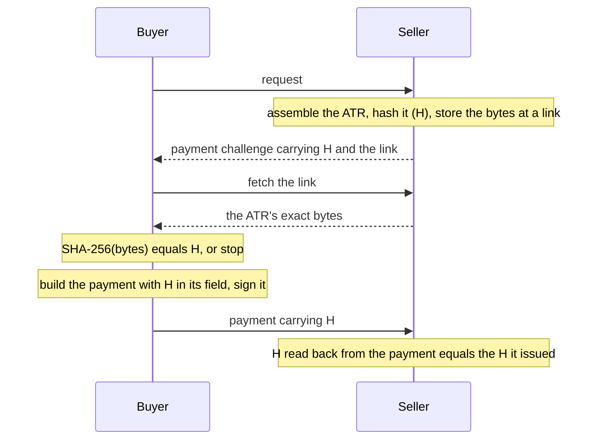

# Overview

When one AI agent buys from another, it reads terms, perhaps negotiates, and pays. The **Legal Context Protocol
(LCP)** makes the payment prove what was agreed: the payment carries the hash of the agreement's record, so paying is
agreeing to that exact record.

[`@integraledger/lcp`](https://github.com/IntegraLedger/integra-protocol/tree/main/lcp) is its reference
implementation, for TypeScript and JavaScript. It assembles the record, hashes it, and binds the hash into payments on
x402, MPP, agentic checkouts and card networks, across EVM chains, Solana, Stellar, the XRP Ledger and every other
rail the [rails guide](./guides/rails.md) lists.

## How it works

1. **The seller assembles the record.** The Agentic Transaction Record holds a format marker, a per-transaction id,
   the values that tie it to this payment, and whatever the parties agreed, byte for byte.
2. **The seller advertises its hash.** H goes into the payment challenge, beside an `https` link to the seller's copy.
3. **The buyer compares before it signs.** It fetches the bytes, hashes them, and signs nothing unless they hash to H.
4. **The payment carries H.** The buyer signs a payment with H in the field its protocol or rail provides: a nonce, a
   memo, a salt, an invoice field.
5. **Anyone holding the record can match it.** The seller reads H back from the payment, and on most rails from the
   settlement on chain.

The package fixes the bytes, the hash and where H rides. It does not decide what the record says, and it never
compares amount, payee, asset, timing or payer with the record's content: that is between the parties, and the record
is what they agreed.

## Terms

These pages use each term in one sense:

| Term | Meaning |
|---|---|
| **Agentic Transaction Record (ATR)** | The agreement's record, a JSON document the seller serves. |
| **ATR hash (H)** | SHA-256 over the ATR's exact bytes. |
| **Legal Context Protocol (LCP)** | The pattern this package implements: the payment carries H, so paying is agreeing to that exact record. |
| **Pairing** | A payment protocol, scheme and rail combination, such as `x402/exact/eip155/eip3009`. |
| **Binding** | How H rides in a pairing's payment: the field its specification defines. |
| **Buyer gate** | The buyer-side check that compares the served bytes with H before anything is signed. |
| **Seller** | The party serving the resource. |
| **Facilitator** | The x402 role that verifies and settles. |
| **Vectors** | The shared test cases that fix the rules byte for byte across languages. |

## Where to start

| You are | Read |
|---|---|
| New to LCP | [Getting started](./getting-started.md): one x402 payment, both sides, in one program. |
| Building a seller | [Seller](./guides/seller.md): assemble, advertise, check the payment, read the settlement. |
| Building a buyer | [Buyer](./guides/buyer.md) and [the buyer gate](./concepts/buyer-gate.md). |
| Selling by channel, session or subscription | [Channels, sessions and subscriptions](./guides/sessions.md). |
| Working on one protocol | [x402](./guides/x402.md), [MPP](./guides/mpp.md), or [agentic checkouts](./guides/checkouts.md) for ACP, UCP, AP2, ACK, card networks and A2A. |
| Working on one chain | [Rails](./guides/rails.md): the field H rides in on each chain and network. |
| Publishing your terms | [Discovery](./guides/discovery.md): the document at `/.well-known/legal-context.json`. |
| Implementing LCP in another language | [Vectors](./concepts/vectors.md) and the [vector files](./reference/vectors.md). |

## The documentation

- **Concepts** explain each rule: [the ATR](./concepts/atr.md), [the ATR hash](./concepts/atr-hash.md),
  [binding](./concepts/binding.md), [pairings](./concepts/pairings.md), [the buyer gate](./concepts/buyer-gate.md),
  [refusals](./concepts/refusals.md) and [vectors](./concepts/vectors.md).
- **Guides** walk each flow with a program you can run: [seller](./guides/seller.md), [buyer](./guides/buyer.md),
  [channels, sessions and subscriptions](./guides/sessions.md), [x402](./guides/x402.md), [MPP](./guides/mpp.md),
  [agentic checkouts](./guides/checkouts.md), [rails](./guides/rails.md) and [discovery](./guides/discovery.md).
- **Reference** is generated from the package: [entry points](./reference/entry-points.md),
  [pairings](./reference/pairings.md), [refusal codes](./reference/refusals.md),
  [vector files](./reference/vectors.md) and the [API](./reference/api/index.md).

Every TypeScript program in these pages is compiled and run against the package in CI, and its output is checked
against what the page shows.

## For AI agents

The documentation site publishes [`llms.txt`](https://lcp.integraledger.com/llms.txt), an index of every page,
[`llms-full.txt`](https://lcp.integraledger.com/llms-full.txt), every page in one file, and each page as Markdown
under `/md/`, such as [`/md/getting-started.md`](https://lcp.integraledger.com/md/getting-started.md).

## Source and license

The source is at [github.com/IntegraLedger/integra-protocol](https://github.com/IntegraLedger/integra-protocol),
under the [Apache-2.0](https://github.com/IntegraLedger/integra-protocol/blob/main/LICENSE) license. The buyer
packages are in [`integra-agentic-terms`](https://github.com/IntegraLedger/integra-agentic-terms), and the seller
door's contract and connectors in
[`integra-agentic-connectors`](https://github.com/IntegraLedger/integra-agentic-connectors).
