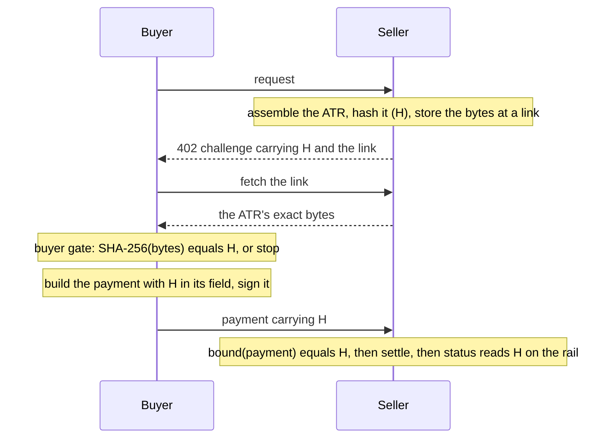

# @integraledger/lcp

Assemble an Agentic Transaction Record, hash its exact bytes, and bind that hash into the payment, on x402, MPP,
agentic checkouts and card networks, across every chain and rail they settle on.

[](https://www.npmjs.com/package/@integraledger/lcp)
[](https://github.com/IntegraLedger/integra-protocol/blob/main/lcp/LICENSE)


`@integraledger/lcp` is the reference implementation of the **Legal Context Protocol (LCP)**: the pattern in which
the payment carries the hash of the agreement's record, so paying is agreeing to that exact record. The seller
assembles the record and advertises its hash; the buyer fetches the record, compares it with the hash, and signs a
payment that carries the hash; the seller reads the hash back from the payment and from the settlement.

The package is deterministic and small at its core. It holds no key, signs nothing, calls no network on its own, and
carries no business or legal logic. What the agreement says is the parties' business; this package makes sure that
what they agreed is the record the payment is bound to.

- [Key concepts](#key-concepts)
- [Install](#install)
- [Quickstart](#quickstart)
- [Guides](#guides)
- [API](#api)
- [Supported pairings](#supported-pairings)
- [What it guarantees, and what it does not](#what-it-guarantees-and-what-it-does-not)
- [Vectors and conformance](#vectors-and-conformance)
- [Requirements](#requirements)

## Key concepts

| Term | Meaning |
|---|---|
| **Agentic Transaction Record (ATR)** | The agreement's record, a JSON document the seller serves. |
| **ATR hash (H)** | SHA-256 over the ATR's exact bytes. |
| **Legal Context Protocol (LCP)** | The pattern this package implements: the payment carries H, so paying is agreeing to that exact record. |
| **Pairing** | A payment protocol, scheme and rail combination, such as `x402/exact/eip155/eip3009`. |
| **Binding** | How H rides in a pairing's payment: the field its specification defines. |
| **Buyer gate** | The buyer-side check that compares the served bytes with H before anything is signed. |
| **Seller** | The party serving the resource. |
| **Facilitator** | The x402 role that verifies and settles. |
| **Vectors** | The shared test cases that fix the rules byte for byte across languages. |



## Install

```sh
npm install @integraledger/lcp
```

The package is ESM only, with type declarations for every entry point. Its three dependencies are `@noble/curves`,
`@noble/hashes` and `@scure/base`.

Some rails parse their wire formats with the rail's own library. Those libraries are optional peer dependencies:
install the one for each rail you use, at the version the package names.

| Rail | Install | Used by |
|---|---|---|
| Solana | `@solana/kit` | the Solana pairings on x402 and MPP |
| Stellar | `@stellar/stellar-sdk` | the Stellar pairings on x402 and MPP |
| XRP Ledger | `ripple-binary-codec` | the XRPL pairings on x402 and MPP |
| Sui | `@mysten/sui` | `x402/exact/sui` |
| NEAR | `@near-js/crypto`, `@near-js/transactions`, `borsh` | `x402/exact/near` |
| TON | `@ton/core` | `x402/exact/tvm` |
| Algorand | `algosdk` | `x402/exact/algorand` |
| Stacks | `@stacks/transactions` | `mpp/charge/usdc/stacks` |

Without its peer, a rail's functions refuse with `<rail>/peer-missing`, or the pairing serves no option. Every other
rail, and every protocol surface, needs nothing more.

## Quickstart

One x402 payment on `x402/exact/eip155/eip3009`, both sides, in one program. A `Map` stands in for the seller's
storage and a random key for the buyer's signer, so it runs without a network. Signing uses
[viem](https://viem.sh) (`npm install viem`); any EIP-712 signer works.

```ts
import { assemble, hash, hashEquals, isRefusal, newAtrId } from "@integraledger/lcp";
import {
  exactEip3009,
  requestCommitment,
  tie,
  type PaymentRequired,
  type PaymentRequirements,
} from "@integraledger/lcp/x402";
import type { TypedDataDefinition } from "viem";
import { generatePrivateKey, privateKeyToAccount } from "viem/accounts";

// The seller's x402 challenge: one option, USDC on Base Sepolia.
const option: PaymentRequirements = {
  scheme: "exact",
  network: "eip155:84532",
  amount: "10000",
  asset: "0x036CbD53842c5426634e7929541eC2318f3dCF7e",
  payTo: "0x209693Bc6afc0C5328bA36FaF03C514EF312287C",
  maxTimeoutSeconds: 60,
  extra: { name: "USDC", version: "2" },
};
const challenge: PaymentRequired = {
  x402Version: 2,
  resource: { url: "https://api.seller.example/v1/quote" },
  accepts: [option],
};

// Seller: assemble the ATR for this request, store its bytes, and advertise H.
const request = await requestCommitment({ method: "GET", target: "/v1/quote", body: new Uint8Array() });
if (isRefusal(request)) throw new Error(request.code);
const terms = new TextEncoder().encode('{"text":"One quote for 10000 base units of USDC."}');
const atr = await assemble(newAtrId(), tie(challenge.accepts, request), [["terms", terms]]);
if (isRefusal(atr)) throw new Error(atr.code);
const link = `https://atr.seller.example/${atr.atrHash}`;
const storage = new Map([[link, atr.bytes]]);
const advertised = exactEip3009.advertise(challenge, atr.atrHash, link, option);
if (isRefusal(advertised)) throw new Error(advertised.code);

// Buyer: read H and the link, fetch the bytes, and compare before signing anything.
const offer = exactEip3009.read(advertised);
if (isRefusal(offer)) throw new Error(offer.code);
const served = storage.get(offer.link);
if (served === undefined || !hashEquals(await hash(served), offer.h)) throw new Error("the ATR does not match H");

// Buyer: build the EIP-3009 authorization whose nonce is H, sign it, and complete the payment.
const payer = privateKeyToAccount(generatePrivateKey());
const unsigned = await exactEip3009.build(
  { required: advertised, accepted: offer.offer.options[0]!, from: payer.address, now: Math.floor(Date.now() / 1000) },
  offer.h,
);
if (isRefusal(unsigned)) throw new Error(unsigned.code);
const payment = unsigned.complete(await payer.signTypedData(unsigned.typedData as TypedDataDefinition));
if (isRefusal(payment)) throw new Error(payment.code);

// Seller: read H from what the payer signed, and match it to the H it issued.
const bound = await exactEip3009.bound(payment);
if (typeof bound !== "string") throw new Error(bound.code);
console.log("the signed nonce is H:", hashEquals(bound, atr.atrHash));
```

```text
the signed nonce is H: true
```

Each pairing's functions return their result or a refusal, `{ refused: true, code }`, whose code names what is wrong,
such as `x402/link-not-https`. `isRefusal(result)` tells the two apart. Only the package makes refusals: a value you
pass in is never returned to you as one, whatever members it carries
([refusals](https://github.com/IntegraLedger/integra-protocol/blob/main/docs/concepts/refusals.md)).

## Guides

The [documentation](https://github.com/IntegraLedger/integra-protocol/tree/main/docs) covers each flow with runnable
examples:

- **Concepts:** [the ATR](https://github.com/IntegraLedger/integra-protocol/blob/main/docs/concepts/atr.md),
  [the ATR hash](https://github.com/IntegraLedger/integra-protocol/blob/main/docs/concepts/atr-hash.md),
  [binding](https://github.com/IntegraLedger/integra-protocol/blob/main/docs/concepts/binding.md),
  [pairings](https://github.com/IntegraLedger/integra-protocol/blob/main/docs/concepts/pairings.md),
  [the buyer gate](https://github.com/IntegraLedger/integra-protocol/blob/main/docs/concepts/buyer-gate.md).
- **Seller:** assemble, advertise, check the payment, read the settlement
  ([guide](https://github.com/IntegraLedger/integra-protocol/blob/main/docs/guides/seller.md)).
- **Buyer:** compare, then build and sign, then finish
  ([guide](https://github.com/IntegraLedger/integra-protocol/blob/main/docs/guides/buyer.md)).
- **Channels, sessions and subscriptions:** one ATR for a whole channel
  ([guide](https://github.com/IntegraLedger/integra-protocol/blob/main/docs/guides/sessions.md)).
- **Protocols:** [x402](https://github.com/IntegraLedger/integra-protocol/blob/main/docs/guides/x402.md),
  [MPP](https://github.com/IntegraLedger/integra-protocol/blob/main/docs/guides/mpp.md),
  [ACP, UCP, AP2, ACK, cards and A2A](https://github.com/IntegraLedger/integra-protocol/blob/main/docs/guides/checkouts.md).
- **Rails:** where H rides on each chain and payment network
  ([guide](https://github.com/IntegraLedger/integra-protocol/blob/main/docs/guides/rails.md)).

## API

Each entry point is imported by its subpath. The core:

| Export | What it does |
|---|---|
| `assemble(id, binding, content, limits?)` | Writes the ATR's bytes in fixed order and returns them with H, or a refusal. |
| `newAtrId()` | A random RFC 9562 version 4 UUID for the ATR's `id`. |
| `hash(bytes)` | SHA-256 over the bytes as given, as `0x` and lowercase hex. |
| `hashEquals(a, b)` | True when both are 32-byte hashes, in either case, with the same bytes. |
| `isRefusal(v)` | True only for a refusal this package made: how a caller tells a refusal from a result. |
| `toLcpString(h)`, `fromLcpString(s)` | H as `lcp:sha256:0x…` (`LCP §8.1`), and back. |
| `toLegalContext(h, url, spelling?)`, `fromLegalContext(o)` | H and the link as `{ legalContext: { type, value, legalContextUrl } }` (`LCP §8.1`), and back. |
| `toRawBytes(h)`, `fromRawBytes(b)` | H as 32 raw bytes, and back. |
| `isHttpsLink(s)` | The one rule every link to an ATR meets. |
| `digestJson(v)`, `canonicalJson(v)` | SHA-256 over the RFC 8785 form of a JSON value, and that form. |
| `parseJson(text)`, `jsonWithinDepth(text)`, `MAX_JSON_DEPTH` | JSON reading capped at 64 levels of nesting. |
| `BINDINGS` | Every pairing this package implements. |
| `pairingOf(option)` | The x402 pairing that serves an x402 option. |
| `pairingsOfPlaced(challenge)` | The MPP pairings a placed MPP challenge offers. |
| `canonicalTx(binding, tx)` | A transaction id in the one spelling a record keeps. |

The protocol and rail entry points:

| Entry point | Holds |
|---|---|
| `@integraledger/lcp/x402` | x402 documents, the `legalContext` extension, the request commitment, and the EVM `exact`, `upto` and `auth-capture` pairings. |
| `@integraledger/lcp/x402-batch-settlement` | x402 `batch-settlement` on EVM, Solana and Cloudflare: one ATR per channel. |
| `@integraledger/lcp/x402-exact-solana`, `…/x402-upto-solana`, `…/x402-exact-stellar`, `…/x402-exact-xrpl` | The x402 pairings on Solana, Stellar and the XRP Ledger. |
| `@integraledger/lcp/mpp` | MPP challenges, H as the challenge id, and every MPP charge, session and subscription pairing. |
| `@integraledger/lcp/acp`, `…/ucp`, `…/ap2`, `…/ack` | Agentic checkouts: ACP, UCP, AP2 and ACK. |
| `@integraledger/lcp/card` | Visa TAP, Mastercard Verifiable Intent and the plain card checkout. |
| `@integraledger/lcp/a2a` | H and the link in an A2A Task's `metadata`. |
| `@integraledger/lcp/discovery` | The discovery document at `/.well-known/legal-context.json` (`LCP §2`). |
| `@integraledger/lcp/evm`, `…/tempo`, `…/svm`, `…/stellar`, `…/xrpl`, `…/hedera`, `…/avm`, `…/aptos`, `…/cardano`, `…/casper`, `…/ccd`, `…/near`, `…/polkadot`, `…/starknet`, `…/sui`, `…/tron`, `…/tvm`, `…/lightning`, `…/stacks` | Each rail's pieces and pairings: its signed form, where H rides, and the settlement read. |

The [entry point reference](https://github.com/IntegraLedger/integra-protocol/blob/main/docs/reference/entry-points.md)
lists every export of every entry point, and the
[API reference](https://github.com/IntegraLedger/integra-protocol/tree/main/docs/reference/api) gives each signature.

Every pairing has the same members: `id`, `pattern` (what a payment through it proves), `tie` (the ATR's binding
slot), `advertise` and `read` (H into and out of the challenge), `build` (what the buyer signs, with H in its place),
and `bound` (H back out of the payment). Pairings that settle on a readable rail add `reference`, `status` and, where
the rail keeps H, `recover`. EVM pull pairings add `authorizer`, the account whose signature authorises the pull.

## Supported pairings

Generated from `BINDINGS` by `scripts/docs-reference.mjs`, which CI runs to check this list against the registry.

<!-- pairings:start -->
67 pairings on 7 surfaces.

| Surface | Pairings |
|---|---|
| `ack` (1) | `ack/payment-request` |
| `acp` (2) | `acp/checkout/delegated`, `acp/checkout/undelegated` |
| `ap2` (1) | `ap2/checkout-mandate` |
| `card` (4) | `card/mastercard-vi/autonomous`, `card/mastercard-vi/immediate`, `card/seller-reference`, `card/visa-tap` |
| `mpp` (26) | `mpp/charge/card`, `mpp/charge/evm/authorization`, `mpp/charge/evm/hash`, `mpp/charge/evm/permit2`, `mpp/charge/evm/transaction`, `mpp/charge/hedera`, `mpp/charge/lightning`, `mpp/charge/nearintents`, `mpp/charge/solana`, `mpp/charge/stellar`, `mpp/charge/stripe`, `mpp/charge/tempo/memo`, `mpp/charge/tempo/push`, `mpp/charge/usdc/evm`, `mpp/charge/usdc/gateway`, `mpp/charge/usdc/solana`, `mpp/charge/usdc/stacks`, `mpp/charge/xrpl`, `mpp/session/evm`, `mpp/session/hedera`, `mpp/session/lightning`, `mpp/session/solana`, `mpp/session/tempo`, `mpp/session/xrpl`, `mpp/subscription/stripe`, `mpp/subscription/tempo` |
| `ucp` (4) | `ucp/booking/ap2-mandate`, `ucp/booking/unsigned`, `ucp/checkout/ap2-mandate`, `ucp/checkout/unsigned` |
| `x402` (29) | `x402/auth-capture/eip155/eip3009`, `x402/auth-capture/eip155/permit2`, `x402/batch-settlement/cloudflare`, `x402/batch-settlement/eip155`, `x402/batch-settlement/solana`, `x402/exact/algorand`, `x402/exact/aptos`, `x402/exact/cardano`, `x402/exact/casper`, `x402/exact/ccd`, `x402/exact/eip155/eip3009`, `x402/exact/eip155/erc7710`, `x402/exact/eip155/erc7710-salt`, `x402/exact/eip155/permit2`, `x402/exact/hedera`, `x402/exact/hedera/transfer-executor`, `x402/exact/lnbtc`, `x402/exact/lnbtc/invoice-named`, `x402/exact/near`, `x402/exact/polkadot/lcp-assets-remark`, `x402/exact/solana`, `x402/exact/starknet`, `x402/exact/stellar`, `x402/exact/sui`, `x402/exact/tron/lcp-trc20-memo`, `x402/exact/tvm`, `x402/exact/xrpl`, `x402/upto/eip155/permit2`, `x402/upto/solana` |
<!-- pairings:end -->

The [pairings reference](https://github.com/IntegraLedger/integra-protocol/blob/main/docs/reference/pairings.md)
gives each one's binding pattern, whether the buyer signs H, whether H is on chain, and the sentence its record states
about what the payment proves.

## What it guarantees, and what it does not

**It does:**

- write an ATR's bytes deterministically, and hash exactly those bytes;
- compare hashes by their 32 bytes, in either case;
- place H, and the link to the seller's copy, where each pairing's specification provides a place;
- build what the buyer signs with H in its place, and read H back from what was signed;
- read settlement through a reader you supply, with a bounded number of calls, and treat a failed read as pending,
  never as failed;
- state, for every pairing, what a payment through it proves, and never claim more. Where the buyer's approval does
  not sign H, the record says so.

**It does not:**

- decide what an ATR contains, or read the parties' content;
- check amount, payee, asset, timing or payer against the ATR's content: a discrepancy is between the parties, and the
  record is what they agreed;
- hold keys, sign, move funds, call a facilitator or fetch anything on its own;
- store ATRs: the seller and the buyer each keep their own copy;
- verify every signature it reads: each pairing's `proves` names which signatures the rail or network verifies and
  which this package checks.

## Vectors and conformance

The package ships its test vectors in `vectors/`: one JSON file per entry point or pairing, each with an `about` that
names where its expected values come from (published specification examples, standard test values, live network reads
and independent tools). They fix the ATR's exact bytes and hash, each refusal, the link rule, the buyer gate's rows, and
for each pairing the placed challenge, what the payer signs, H read back, and the settlement read. Any implementation
that passes them agrees with this one byte for byte. The package's own tests run every file, and the buyer packages in
[`integra-agentic-terms`](https://github.com/IntegraLedger/integra-agentic-terms) run them from TypeScript and Python.

The LCP profiles this package implements ship in `profiles/`, one Markdown file per profile, each stating its
binding's rules.

## Requirements

- Node.js `>=26.10.0`.
- ESM. TypeScript users need `"moduleResolution": "nodenext"` (or `"bundler"`) to resolve the subpath exports.
- Cloudflare Workers, with or without the `nodejs_compat` flag. Install the optional peer dependencies before
  bundling: without them, wrangler's bundler cannot resolve `@mysten/sui/bcs`, `@mysten/sui/utils`, `@near-js/crypto`,
  `@near-js/transactions` and `borsh`.

## Related packages

- [`integra-agentic-terms`](https://github.com/IntegraLedger/integra-agentic-terms): the buyer gate as packages for
  TypeScript, Python and MCP clients.
- [`integra-agentic-connectors`](https://github.com/IntegraLedger/integra-agentic-connectors): the seller door's
  contract and connectors.

## Contributing

See the [repository README](https://github.com/IntegraLedger/integra-protocol#readme) and
[CONTRIBUTING.md](https://github.com/IntegraLedger/integra-protocol/blob/main/CONTRIBUTING.md).

## License

[Apache-2.0](https://github.com/IntegraLedger/integra-protocol/blob/main/lcp/LICENSE).
